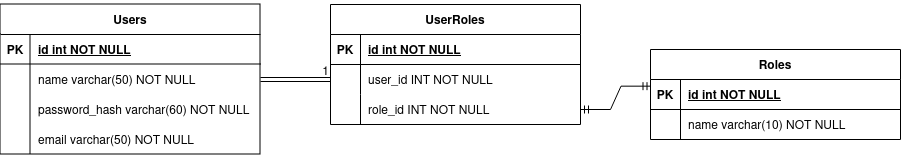
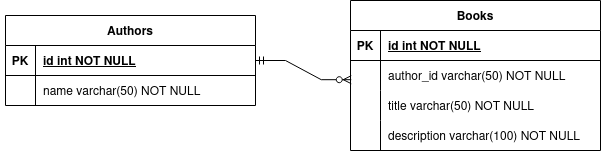

# Books Api in Go

## Installation

### Requirements
1. Docker

### Running the App
**NOTE**: make sure docker engine is set to `linux`  
[Set up Linux Containers on Windows 10](https://learn.microsoft.com/en-us/virtualization/windowscontainers/quick-start/quick-start-windows-10-linux)

Here are the steps for running the app:
1. Build the Dockerfile, `docker build --tag books-api .`
2. Run docker compose, `docker compose up --build -d`

### DB Credentials
Credentials for pgadmin service:  
Email: `admin@example.com`  
Password: `admin`

Credentials for db service:  
Username: `postgres`  
Password: `securepassword`

## Documentation 

### ER diagram
This sections provides information on the Entity Relationships present in the API

#### Users


This diagram shows how users and roles are related, 
The `UserRoles` table is an example of a junction table, 
which is used to implement a many-to-many relationship between the `Users` and `Roles` tables. 
In this case, we will not perform many-to-many relationship transactions.
`UserRoles` had to be specifically used for normalization purposes.

#### Authors and Books


This diagram shows how authors and books are related,
the connection between them is a one-to-many relationship, i.e. an author can have many books

### Endpoints

#### Authors 
<details>
    <summary> Create Author </summary>
    `POST /authors`  
    ```
    {
        "name": string
    }
    ```
</details>

<details>
    <summary> Get Authors </summary>
    `GET /authors`  
</details>

<details>
    <summary> Get Author by ID </summary>
    `GET /authors/:id`  
</details>

<details>
    <summary> Update Author </summary>
    `PUT /authors/:id`  
    ```
    {
        "name" string
    }
    ```
</details>

<details>
    <summary> Remove Author </summary>
    `DELETE /authors/:id`  
</details>

#### Books

#### Users


TODO:
- Login (All Users)
- Logout (All Users)
- Create Book (Admin)
- Get Book by Id (Admin & User)
- Get Books (Admin & User)
- Update Book by Id (Admin)
- Delete Book (Admin), Cascade delete
