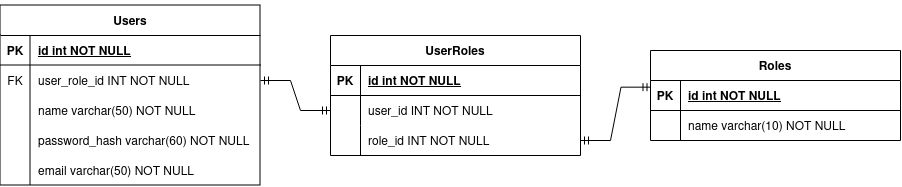
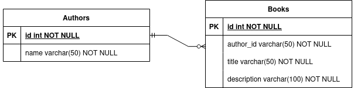

# Books Api in Go

## Installation instructions
- docker compose 
- dockerfile

## Documentation 

### ER diagram
This sections provides information on the Entity Relationships present in the API

#### User

This diagram shows how users and roles are related, `UserRoles` had to be specifically used for normalization purposes.

Specifically, The `UserRoles` table is an example of a junction table, 
which is used to implement a many-to-many relationship between the `Users` and `Roles` tables. 
In this case, we will not perform many-to-many relationship transactions.

#### Authors and Books

This diagram shows how authors and books are related, the connection between them is a one-to-many relationship, i.e. an author can have many books

### Endpoints
- Endpoints
    - Login (All Users)
    - Logout (All Users)
    - Create Book (Admin)
    - Create Author (Admin)
    - Get All Books (Admin & User)
    - Get All Authors (Admin & User)
    - Get Book by Id (Admin & User)
    - Get Author by Id (Admin & User)
    - Delete Resource (Admin), type = hard and soft
        - Soft Delete Author (Admin), Cascade soft delete
        - Soft Delete Book (Admin), Cascade soft delete
        - Hard Delete Author (Admin), Cascade hard delete
        - Hard Delete Book (Admin), Cascade hard delete
